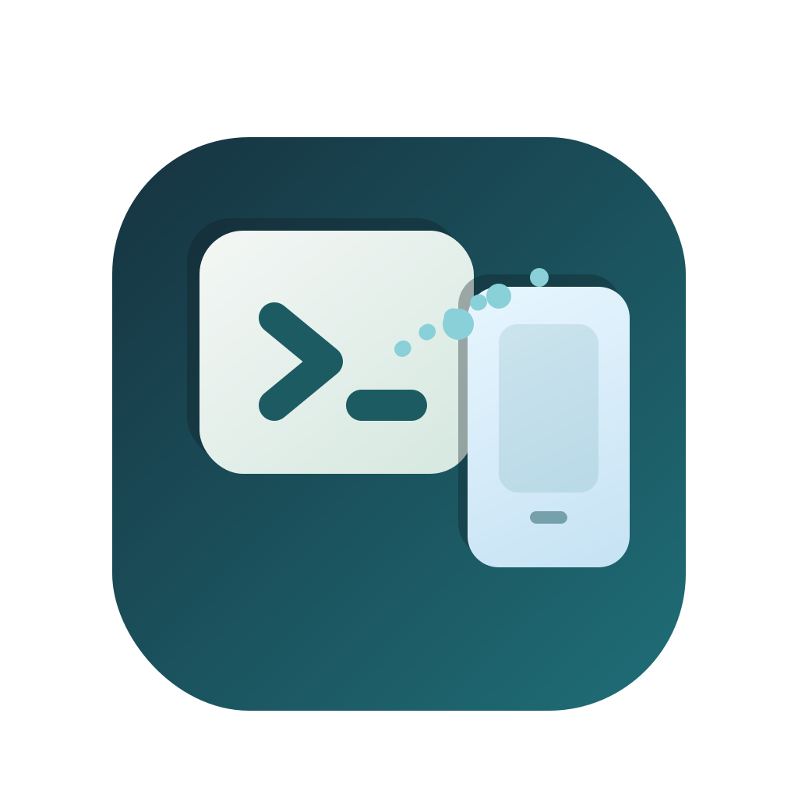

<p align="center">
  
</p>

# desktop-notify-relay

Forward selected Linux desktop notifications to `ntfy`.

This project is intended for Codex task-complete notifications on local machines:

- watch `org.freedesktop.Notifications` on the session D-Bus
- filter notifications by configurable regex rules
- forward matching notifications to a private `ntfy` topic
- run as a `systemd --user` service

## Why

Use case:

- Codex runs locally on a desktop or laptop
- desktop notifications already appear when long tasks finish
- phone should receive only those Codex-related notifications
- Discord, mail, chat, etc. should not be forwarded

## Current approach

- no Codex prompt/tool changes
- no i3 scraping
- no Kitty hacks
- just listen to desktop notifications at the freedesktop notification layer

## Files

- `relay.py`:
  main relay process
- `config.example.json`:
  example config file
- `systemd/desktop-notify-relay.service`:
  user service unit example
- `assets/logo.svg`:
  editable source logo
- `assets/logo.png`:
  rendered README/logo asset

## Local setup

Create local config:

```bash
mkdir -p ~/.config/desktop-notify-relay
cp config.example.json ~/.config/desktop-notify-relay/config.json
```

Create local env file:

```bash
cat > ~/.config/desktop-notify-relay/env <<'EOF'
NTFY_TOKEN=replace_me
EOF
chmod 600 ~/.config/desktop-notify-relay/env
```

Edit `~/.config/desktop-notify-relay/config.json`:

- set the `topic`
- adjust filters as needed

## Run in foreground

```bash
python3 relay.py --config ~/.config/desktop-notify-relay/config.json
```

## Install as a user service

```bash
mkdir -p ~/.config/systemd/user
cp systemd/desktop-notify-relay.service ~/.config/systemd/user/
systemctl --user daemon-reload
systemctl --user enable --now desktop-notify-relay.service
```

## Notes

- The initial filter should stay simple until real Codex notifications are observed.
- The relay logs every seen notification to stdout/journal when `log_all_notifications` is enabled.
- The `ntfy` token should not be committed to git.
